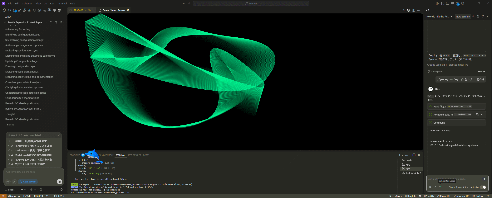

# otak-screensaver

VS Code の中でスクリーンセーバー（Beziers / Mystify）を表示します。

## 使い方

- ステータスバーのアイコンを押すと表示/終了（トグル）
- コマンドパレットからも起動できます
  - `Toggle ScreenSaver`
  - `ScreenSaver: Beziers`
  - `ScreenSaver: Mystify`
- 自動起動を有効にすると、一定時間操作が無いと自動で起動します（操作すると終了します）

## 設定

- `otakScreensaver.mode`: `random` / `beziers` / `mystify`
- `otakScreensaver.autoStart`: 自動起動（true/false）
- `otakScreensaver.idleMinutes`: 自動起動までの待ち時間（分、デフォルト 5）

## 開発

1. このフォルダを VS Code で開く
2. `F5`（Extension Development Host）で起動
3. 自動コンパイルしたい場合は `npm install` → `Run Extension (Watch)`
4. 日本語の文末コロン（`:` / `：`）チェック: `npm run lint:jp-colon`
