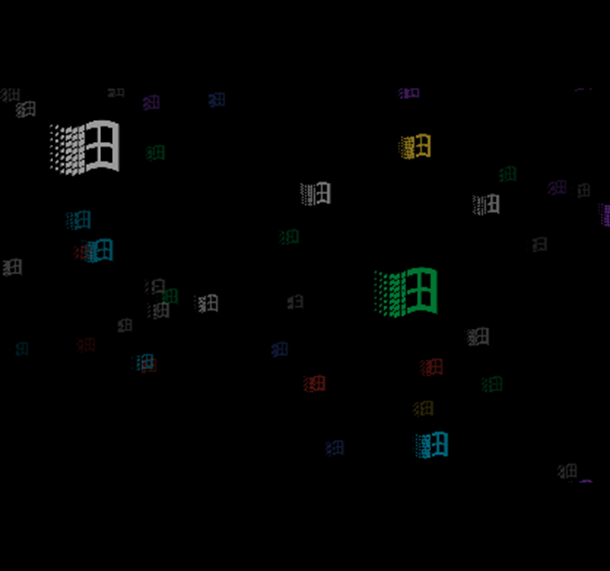
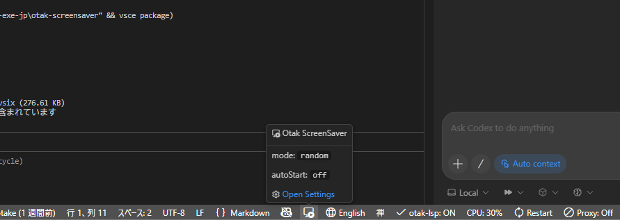

# otak-screensaver

  
  
  

Run classic screensavers (Beziers / Mystify / Flying Windows) right inside VS Code.

## Usage

- Click the status bar icon to toggle on/off
- Launch from the Command Palette
  - `Toggle ScreenSaver`
  - `ScreenSaver: Beziers`
  - `ScreenSaver: Mystify`
  - `ScreenSaver: Flying Windows`
- Enable auto start to launch after inactivity (stops on input)

## Settings

- `otakScreensaver.mode`: `random` / `beziers` / `mystify` / `flyingWindows`
- `otakScreensaver.autoStart`: auto start (true/false, default true)
- `otakScreensaver.idleMinutes`: idle time before auto start in minutes (default 5)
- `otakScreensaver.preventDisplaySleep`: best effort screen wake lock while screensaver is open (true/false, default true)
- `otakScreensaver.codespacesKeepAlive`: run a background keep-alive process for GitHub Codespaces to prevent idle timeout (true/false, default true)
- `otakScreensaver.codespacesKeepAliveIntervalMinutes`: interval in minutes to check the keep-alive process is running (default 3)

> **Note (Codespaces):** When keep-alive is enabled, a background shell process runs continuously to prevent the Codespace from timing out. Remember to stop the Codespace manually when you are done to avoid unnecessary usage.

## Development

1. Open this folder in VS Code
2. Press `F5` to launch the Extension Development Host
3. For auto-compile: `npm install` then `Run Extension (Watch)`
4. Japanese sentence-ending colon check: `npm run lint:jp-colon`
